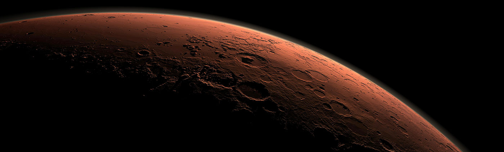
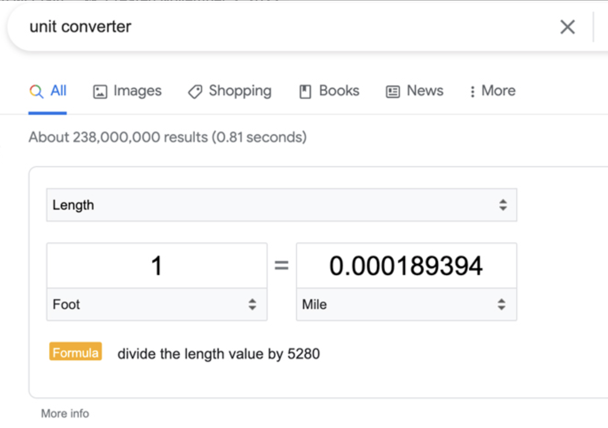
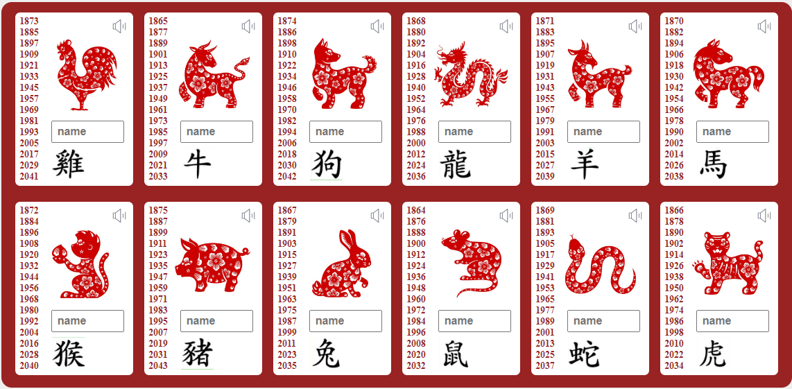
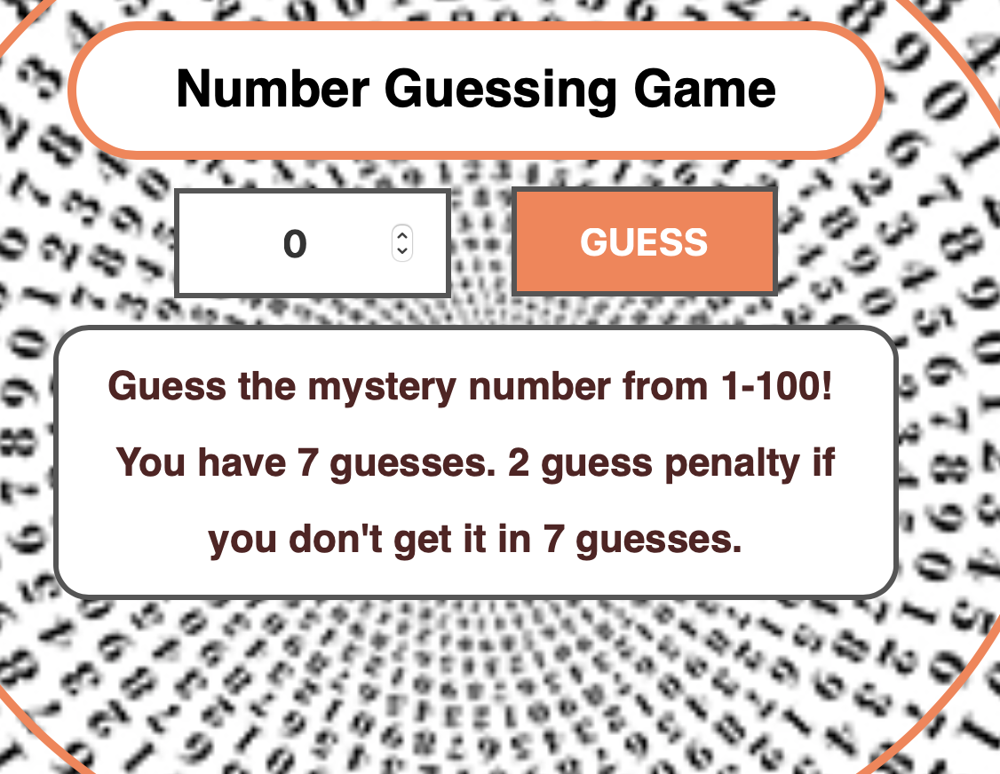
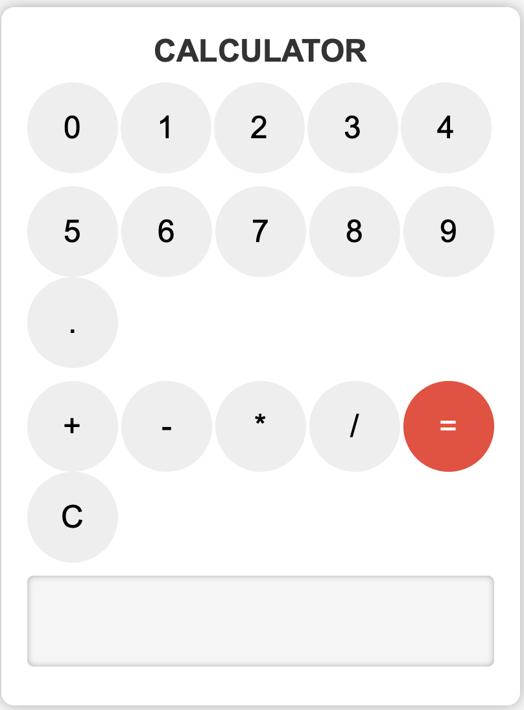

**Projects 📄**
<h2 class="space-ship">Space Ship project</h2>

Created a full-stack web application to showcase different Mars missions, using JavaScript and React for the front-end and back-end, and deployed the website using Render.  <a href="https://spacemission.onrender.com">View the website</a>

<h2 class="tic-tac-toe">TicTacToe project</h2>

Built a Tic Tac Toe game using JavaScript for the front-end and logic of the game.   <a href="https://tictactoe-dm6v.onrender.com">Play Game</a>

<h2 class="naruto-characters">NarutoCharacters</h2>

Developed a web page showcasing different Naruto characters using JavaScript for dynamic display and interaction via EJS.   <a href="https://naruto-85yv.onrender.com">Naruto App</a>

<h2 class="pokemons">Pokemons</h2>

Created a Pokemon database that displays information about different Pokemons using JavaScript for the front-end and to fetch data from APIs.

<h2 class="mcu-characters">McuCharacters</h2>

Built a Full-stack website displaying information about Marvel Cinematic Universe characters using JavaScript for dynamic display and interaction.  <a href="https://mcufrontend.onrender.com">Marvel Characters</a>

<h2 class="google-units-converter">GoogleUnits converter</h2>

Developed a unit converter that converts between different units of measurement using JavaScript for the logic and front-end of the converter.  <a href="https://googleunitsconverter.onrender.com">Google Units Converter</a>

<h2 class="password-generator">Password Generator</h2>

Developed password generator using JavaScript for the logic and front-end.  <a href="https://passwordgenerator-5ahn.onrender.com">Password Generator</a>

<h2 class="Mandarin-studies">Learning Mandarin</h2>

Developed a Mandarin Language study tool using JavaScript for the logic and front-end.  <a href="https://learningmandarin.onrender.com">Mandarin Studies</a>

<h2 class="Number-game">Guess the Number</h2>

A simple game of guessing the random number between 1-100  <a href="https://numberguessing.onrender.com">Number Game</a>

<h2 class="Calc">Calculator Project</h2>

A basic calculator application built using HTML, CSS, and JavaScript.  <a href="https://calc-6og7.onrender.com">Calculator</a>

